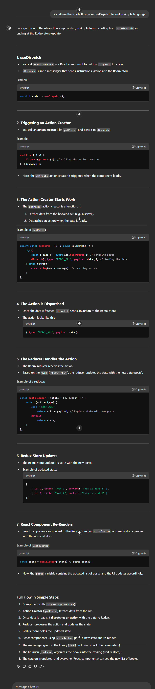
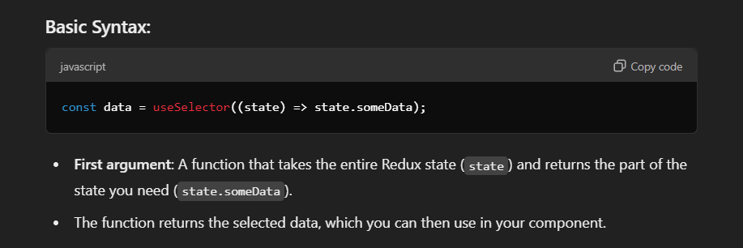
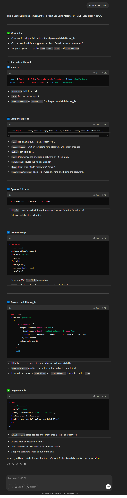
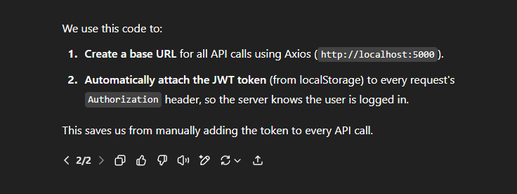

# in index.js :

in express js we are writing the server side code in short we are the server and we are testing our server using our web browser

## index.js/Line (8-11)--> In bodyparser:(Servr side)

When extended: true, the server can handle more complex data structures (like objects and arrays) sent in the URL-encoded format.

When extended: false, The data you send must be simple key-value pairs, like form data (e.g., name=John&age=25).

When data is sent to the server, it's just raw text. Parsing turns that text into something the server can understand and work with, like an object or a list.

Body-parser is used to convert incoming request data (whether it's JSON or form data(urlencoded)) into a format (like an object) that your server can easily use..

Body-parser is only responsible for handling incoming requests—specifically, for parsing the data sent by the client to the server. It does not send requests.

meaning of incoming in this context -- >
So, incoming means data that is coming into your server from a client(like a web browser, mobile app, or another server).

# mongoDB-atlas -> hosts our database on their cloud

# express.Router() --> in ROUTES folder and its connection with index.js

If your app has many routes (like /users, /posts, /comments), putting all of them in one file can get messy. express.Router helps you split them into smaller, more manageable files.

steps how flow of routes works :

1. The main server.js receives the incoming request.
   server.js checks the request's path.
2. If the path starts with /users, it sends the request to the users.js router.
3. If the path starts with /posts, it sends the request to the posts.js router.

- these above 2 steps are done with the help of app.use(), method tells the main server app that whenever a request starts with a specific base path (like /users or /posts)

4. Inside users.js or posts.js, the router handles the request and sends a response.

# meaning of '/'

In short, '/' always refers to the starting point of the current route or router it is defined in.

eg --> /posts/: Root of posts functionality (e.g., http://localhost:3000/posts/).

# Controllers folder

it contains all the logic part of the routes , we can also say it contains all the handlers required

# Routes

contains all the specific route part.(meaning containng actual routes), whereas logic for these routes are stored in controllers.

# schema

schema defines the structure and format of what our posts will look like.(means stting up an convention what our post is suppsoed to look like).

A Mongoose Schema is a blueprint for your MongoDB documents. It defines the structure, properties, and types of data that your collection should store.

# useStyles() hook:

# model -->

a model provides an interface for interacting with a specific MongoDB collection. It lets you perform CRUD operations (Create, Read, Update, Delete) on the data in that collection.

1. The schema defines the structure of a document.or(You can say that a Mongoose schema defines the format or structure of a specific subset of the database, which is typically a collection.)

2. The model (Post) allows you to work with the collection in the database (posts).
3. You can now use "Post" to create, read, update, or delete documents in the (posts) collection.

A model is like a bridge between your code and the database:

Schema = Blueprint for documents.
Model = Tool to work with the database using that blueprint.
for refernce refer the model folder PostMessage.js file

# base64 -->

this converts our images into string.

# controller/posts/line:15:--> const newPost = new PostMessage(post); (refer whole createPost )

--> post is an object that holds the data we want to store (e.g., title, message).

--> new PostMessage(post) is a new PostMessage object initialized with this data. as "new PostMessage(post)" is now a valid object that you can save to your MongoDB database using Mongoose methods like newPost.save().It represents a new post that you want to store in your database.

we created this object of the model"PostMesage" to interact with the database

so everytime we create a new post a new object is created

why create a object: to isolate posts each from each other.

in this the model represent a "Class(postSchema)" and the
"new postMessage" represents a object created over each new post created in Frontend.

# try ,catch and finally :

# material-ui --> more like a css with pre styled strucures.

## key differnece between the code in server/routes/posts.js and client/src/ap/index.js

-->the code in index.js(Api folder) is responsible for :

Makes an HTTP GET request to https://localhost:5000/posts using Axios.

Likely used in the frontend to fetch data from the backend API.(makes API request), it request data from the bakend.

--> the code in server/src/routes/posts :
it handles the the request made by frontend and is written in express(node). meaning the code designed on server to handle requests.

# Axios-->

Axios is a JavaScript library that makes it easy to send HTTP requests (like GET, POST, PUT, DELETE) to interact with servers, APIs, or backend systems.

### Redux:

Redux is like a manager that helps you organize the state (data) of your application in one central place

Use cases of Redux :
It’s most useful when your app grows complex, with a lot of shared data that multiple components need.

For smaller apps, you might not need Redux and can use simpler tools like React’s useState or useContext.

# -->Reducer:

A reducer is like a decision-maker in your app that tells how the state (data) should change when something happens.(explained in above image in library analogy ).

but reducer only manages data store and nothing else managing includes:

Based on the action it receives, the reducer decides how to update the state.

It doesn’t fetch data from APIs.(that is done by api)

It doesn’t handle user input or make decisions about what action to dispatch.

It doesn’t directly modify the Redux store—it only returns the new state.(The reducer creates and returns a new state object, without mutating the current state.)

The actual modification of the store is handled internally by Redux.

so here we can say that that the reducer does the work.

# -->CombineReducer:

In Redux, combineReducers is a helper function that allows you to split your state management into smaller pieces by dividing the reducers. It combines multiple reducers into one main/root reducer.

In our application we built a index.js file in client/src/reducer/index.js this file contains CombineReducers which merger reduceres in reducers folder(like posts and others reducders built and exports them to index.js in client/src folder)

# -->ConfigurStore:

configureStore is a function that simplifies the process of setting up a Redux store, setting up a store required multiple steps like manually adding middleware, writing boilerplate for reducers, and configuring DevTools.

# --> thunk:

Thunk is a kind of middleware for Redux. It allows you to write functions (called thunks) that can perform asynchronous operations like fetching data from an API, and then dispatch actions based on the result of those operations.

Actions are plain objects (e.g., { type: "ADD_TODO", payload: "Buy milk" }).

Actions describe **what happened** but cannot handle **how it happened** (e.g., fetching data from a server).

1. **Thunk solves this** by letting you write actions as functions that can handle asynchronous tasks. These functions can:
   Perform async operations like API calls.

Dispatch other actions based on the result of those operations.

2. Normally, Redux actions are dispatched as objects,With Thunk you can dispatch them as a function,

Then ,Thunk middleware will:

Intercept this function.
Execute the logic inside the function.
Dispatch actions when needed (e.g., after the async task is complete).

Without Thunk:
Redux doesn’t handle async operations directly. If you want to fetch data from an API, you would need to handle it outside Redux and manually dispatch actions.

With Thunk:
You can write an async function to fetch data and dispatch actions based on the response.

in summary thuk provides:
**Thunk Handles Asynchronous Logic**
**Provides a middleware.**

# --> dipatch:

dispatch is a function used to send (or dispatch) an action to the Redux store.

The action you dispatch is sent to the reducer, where the state is updated based on the action type.

The useEffect is like instructions saying, "Ask the helper(dispatch(getPosts)) to fetch posts when this page loads."

The dependency array [dispatch] tells React to re-run the code inside useEffect if dispatch ever changes,In most cases, dispatch doesn't change ,Adding it to the dependency array is mostly a safeguard. It ensures your code follows best practices and avoids potential issues if dispatch were to somehow change

# -->client\src\actions\posts.js

this contains a Redux action creator "getPosts" used in above dispatch to call action

Normally, an "action creator" is a function that creates and sends (dispatches) an action to Redux immediately.

# --> Asynchronous here:

Asynchronous means that some tasks in your code don’t happen immediately—they take time to complete, but your program doesn’t stop and wait for them. Instead, it moves on to the next thing while the task runs in the background.

In the context of your Redux flow, asynchronous refers to operations like fetching data from a server (API calls).
These operations don’t give you results instantly because they rely on external systems (like a database or an internet connection).

## useEffect hook :

useEffect is a React hook that lets you run side effects in your components. Side effects can be tasks like:

Fetching data from an API,Updating the DOM,Setting up event listeners,Subscribing to a service or store

When a component first renders, React will run the useEffect function after the DOM has been updated.

If you pass an array of dependencies as the second argument, React will run the effect again only if any value in that array changes.

## useSelector hook:

useSelector is a hook from React-Redux that allows you to access data from the Redux store inside your React components.

--> useSelector allows you to access a specific part of the Redux state

-->Whenever the selected part of the state changes, your component re-renders automatically to reflect the new data.

-->Unlike useDispatch, which sends actions to update the store, useSelector only reads data from the store. It doesn’t modify anything.

# useState:

In simple terms, it lets you create variables that React "keeps track of"states and updates when necessary, so your component can re-render with new data.

# useState vs UseEffect: 

# useLocation() hook

-->Navbar.js on client Side

# useNavigate() hook :

Navigate (go to another route) it is a replacement of useHistory hook in newer versions
we use it in our Navbar after Logout to go to the auth page:

# reason to use async and await in : server\controllers\posts.js

in getMessages--> is a schema to perform PostMessage.find() will take time therefore we will use await and async.

in UpdatePost--> PostMessages is a schema to perform PostMessage.findIdAndUpdate() will take time therefore we will use await and async

You can change the value of this state variable, and React will update the component to reflect the new value.

# output of a map method is always a array(client\src\reducers\posts.js).

## server\controllers\posts.js (likePost)

# likePost function components explanation:

const { id } = req.params
-->
in the above step we made sure the post existed before that the post existed before we tried to update it.

## Covention of import and Export :

# InputAdornment :

in MUI is a component that lets you add icons, text, or buttons inside a TextField, either at the start or end of the input field.

# endAdorment:

endAdornment adds icons, buttons, or text inside the input, usually on the right side.

✅ InputAdornment is a component that holds an icon, button, or text inside a TextField.

✅ endAdornment is a property that places the adornment at the end of the input field.

💡 Think of InputAdornment as the "box" and endAdornment as the "position" where you put it!
here the eye icon is the adorment/decorative element.

# InputProps:

InputProps is a prop of TextField that allows you to customize the input element inside the field.

It accepts an object where you can pass properties that modify the behavior of the input.
example: 

# isSignup in Auth.js (client\src\components\Auth\Auth.js):

# 

# 

# 

# 

# 

# --> auth.js (client\src\reducers\auth.js)

--> .png>)
auth.js is the reducer that will accept the state and the action

# JSON.parse(...)

The data stored in local storage is always saved as a string. If you originally saved an object (like a user profile), it was turned into a string.
JSON.parse(...) changes that string back into a JavaScript object, so you can use it in your code.

# JavaScript Object(why we use it)

A JavaScript object lets us store related data together in a structured way, using key-value pairs.

keys (name, age, email) and their valuess

# client\src\components\Navbar\Navbar.js

why did we use "user.result.name" and not any other name bcz:

and the result part was decalred on the backend part

# ---------------------------------------------------------------------------------------------------------------------

# Flow of creation

1. setting up two folder server and client for backend and frontend respectively.

2. installing neccesary dependancies like in

# client : axios moment react-file-base64 redux redux-thunk @material-ui/core react-redux

and in

# server:body-parser cors express mongoose nodemon

3. we set up app.js .
4. then we set up index.js in client file to render the app.js file.
5. we then started working on server using express which is based on node following this we created a index.js in our server folder which acts as a main server file called server.js .
6. then we set up body parser middleware and set up mongoogse database and connected these routes to ther specific routes or we can say paths.

7. we created a routes folder in which specified path for routes in posts.js file which sepecies all routes for posts related path.
8. we connected these specified routes to main route in index.js(server folder) file intiaally by imporing our routes as "PostRoutes" in index.js and coonected them using app.us()

9. then we created a controller folder in server folder and then we wrote the logic for posts.js sepecific route in controller folder.(further we will write logic for route of different categories).

10. then we created a schema folder in which we wrote mongoose schema in a file named PostMessage.js which will define format for the contents of post in actual application like all the information fields required to be addded and we will define a model.

11. now we will add more routes and to the to posts.js(routes folder) and add their logic to (controller )posts.js.

12. we added logic in get request and post request logic in controller folder(logic for createPost is explained above) each is async await function and each contain as try and catch block.

13. now we started working on client side creating whole skeleton of frontend application, we use mui-v5 components like container typography and Grid to arrange segments like Posts ,Post and forms,we use Usestyles in v3 but as the v3 version of mui isn not supported any more we used "sx" for v5 , we declared syles and css in styles.js file (prresent in src folder)--> this style.js will define the arrangement of all components on the main page.

14. for css used in componenets Posts,Post and Forms we created a different style.js file in components folder and imported these styles using "sx" in these components individually.(these style swill represent the individual css of these containers).

15. We then created a "index.js" folder creating a file api.js using axios in it's use is to make api calls .

16. then we go to ./client/src/componets/Form/Form.js and built the form.js file built a the outer structure uisng mui-v5 using components like { TextField, Button, Typography, Paper } then we used usestate hook to store state useEffedct hook and useDispatch hook to dispatcb actions to action creators and fro there they go to reducers we aslo used hooks for use selectors

17. this form component is actually responsible for creating ans updating posts in our application.(this form.js comoponent is exported to app.js from there it is bieng renderd )

18. after setting up action creator for usedispatch parameter in from.js we built action parameter in
    **client\src\actions\posts.js** and for to implement this action parameter we already built api (createPost)from which it will implement on the backend
    to implement this dipatch for reducer we built "CREATE" in client\src\reducers\posts.js .
19. we previously created Posts.js and Post.js in components folder the Posts.js in for aarrangement and display of all posts it was later given the structure of a grid using mui-v5 and the Post.js represents the logic for each indivdual post in the whole grid(This step was previously implemeted it's) just the explanation for it .

20. now we will add a background style to our frontend using svg website, then we create a index.csss file in src folder on client side then we connect the index.css to main index.js on client side using import statement.

then we shall have a background like this: 

21. we built a "patch" route using one of http methods in "server\routes\posts.js" and named it updatePost and the we built the logic for this new http method in controllers folder on "server\controllers\posts.js", and also constuced its logic in api(index.js)--> reducers/posts.js -->actions/posts.js,the logic we written here was for updatPost method which will be used in furhet steps(we imported updatePost method in Form.js).

22. to keep track of the current id for that we follow these steps

a. we go to the app.js , in here we will keep track of the current id why in app we ask beacause here will share the state of current id between "Form" and "Post" component, and app.js is the only parent component for both .

b. without redux we will have to bring our parameters upto the top level of app.js then we pass/share them to componenets to "Form" and "Post", we have to pass the props (currenId and setCurrentId) in Form.js and setcurrentId to Post.js to the flow of these components is: like **app.js ->Posts->post(here it come automatically)** and similarly for Form.js (App.js->Form.js).

c. now to these parameters we first created a useState in App.js **const [currentId, setCurrentId] = useState(0);** .

d. we passed these parameters in componets/Posts/Post.js **const Post = ({ post, setCurrentId })** , then we added this **onClick={() => setCurrentId(post.\ \_id)}** in MoreHorizonIcon.

e. then we go to the form.js and we built a useEffect to update data whenever our post changes we define post here as **const post = useSelector((state) => (currentId ? state.posts.find((message) => message. \_id === currentId) : null));**
--> (\_id) this represent the id parameter is dynamic meaning it change acording to the use Input, and the state refers to the redux store, currentId is the paramete we passed in Form **const Form = ({ currentId,setCurrentId })**in the Form.js which we also passed in App.js to Form component in step 21, we also added more in handleSumbit function which describes when to dispatch which method(createPost or UpdatePost) using ifn else.
this whole process from step 21 to step 22 helped us in creating UpdatePost method and also helped in functionality of newHorizonIcon(main piece used in this functionality is useEffect in Form.js )

23. Now we add the "deletePost" functionality we do this by creating backend logic and then connecting it to the fronted,
    **the steps for connection of frontend and backend for this functionality are as follow:**
    a. first we go to posts.js in routes(server\routes\posts.js) and we create a router.delete route using deltePost(which we import from controllers/posts.js), here in this case we first imported then we defined it in controllers.
    b. Now we go to posts.js in controllers(server\controllers\posts.js) to define deletePost .
    c. now as we have built the route we go to the frontend to initiate it we first go to the api in client folder and implelent that api call .(deletePost)
    d. now we go into actions and we create our action creator(deletePost).
    e. now after creating the action we go to the reducers(reducer/post.js)an create"DELETE"case.
    f. now we can finally go into the **post.js(client\src\components\Posts\Post\Post.js)** and dispatch the action, we imported deletePost from actions/posts.js and added the functionality of delete
    button on this page.: **onClick={() => dispatch(deletePost(post.\_id))}**.

24. Now we create a new functionality of likePosts, we will now start again with a full cycle or step 1, (from backend to fontend)
    **steps**
    a. we first go to routes folder (and then to posts.js) in the server and create a "router.patch"route using "likePost" defined and imported from controllers which we will define in the next step .

b. then we go to the controllers and c define the path (likePost explaine i this file on line number:258,259)

c. now we will add the api call in **client\src\api\index.js**.

d.now we can move forward to actions and in here we will create a like action. **(client\src\actions\posts.js)**

e. now we go to reducers and define the function logic for this action, as the logic for both UPDATE and LIKE is almost same we did this (See in code). **(client\src\reducers\posts.js)**

f. now at current stage of this functionality users can  
do as many likesto a post they want, it's not resticted to one like per user , to implement that we to implement the concept of account as this will require authenticatio feature meaniing the login of account id/password and other stuff like implementatio of forgot password feature we will implement in the other further steps.

25. if like we misspelt a string in action type (client\src\actions\posts.js), like if 'FETCH ALL' would we written as :'FETCH AL', the console or system will not give any error, but the functionality will not be working and we will not able to identify the error , to counter this we prefer using constants for these action types:
    a. now we will create a folder named "constants" and a new file called "actiontypes.js" in client src folder,in this we are just putting values of strings in a constant value to get better updation adn monitoring if any error arises

    b. after importing thes actionTypes to actions folder and file we will also impor the files in reducers folder . the logic for like and update is same so in some places the like is considerd as update. in these both files of reducers and actions.

    26. to hide our passwords,username and database name used for mongoDB we will create an "env" file which will be used to store the information as global variable, this file will not be uploaded on GitHub, we will be creating a env example file to upload which will say what to put in those two variables for other users to work with it.

    27. Now we will be deploying our app:
        a. for backend we will be using "heroku" for hosting servers.

26. Now we will add login with email and google authenthicaltion with JWT , so to actually implemet the multipage facility we need to use react-router-dom,We do wraping our components in App.js into BrowseRouter and then we add the switch statemet there and inside the switch statement we will create a Route to homepage and the component will be Home in (client\src\components\Home\Home.js) and then we create another route to the component "auth"

27. Now we will create a reusable component called input.js which creates a form input field and contains different type of text fields .
    
    this componenet was created because if it was not created we have to create all attributes repeatedly for each box / entry of the field to avoid that we created a seprate component input.js that we can reuse .

28. now as we used the custom built input in auth.js , we want to add the feature or functionality to show us the password on clicking the showPassword icon, we will use the hook called "useState" for this:(initially it is set for false)
    **const [showPassword,setShowPassword] = useState(false)**.
    in this page "handleShowPassword" will take the current state from the useState as the previousState and will act as a togglefunction to show or not show Password.
29. what we now did is we addded two modes or to be said precisely two interfaces in one page itself without creating two differnet pages that is "Signup" and "Signin" which is according to the state of the user which is either true or false : "depending on isSignUp" to switch between sigin and signup we used a switchmode fuction in Auth.js which is called by the button st the bottom of the auth codebase.(isSignup explanation above)

30. now we will implement the google "Login Button" which will help us in implementing the authentication with google, for this we used
    **import { GoogleOAuthProvider, GoogleLogin } from '@react-oauth/google';**
    to get the user google id steps at : (time stamp pt3 : 54:00)

31. Now after this we will create two functions in the google login button which represents two conditions which are successfull and unsuccessfull ,the name of the two functions are "googleSuccess" and "googleFailure"(client\src\components\Auth\Auth.js),
    in googleSuccess we will extract user login info using profileObj and the authentication token out of it.

32. now we set up the useNavigate in the Auth.js and then we redirect to our home page after sign in/log in
    and then we adjust this in the googleSuccess fundtion.
    ## WARNING : at this point in develelopment I HAVE A CORS ERROR DUE TO OAUTH interaction with my local Client that is the reason my client id is not getting signed in '
33. Now we will add the functionality of google log out we added Logout in the Navbar then built a LOGOUT dipatch and a Reducer(reducer in auth.js).

34. Now we will implement manul Login/sign in and LOGOUT which will not include google OAuth (this step happen in Auth.js on client Side)
    a)now we ask ourselves whe is this happening and this is happening when we click on the sign in and login button so what did we o we have a look on the jsx first meaning the frontend and now we will figure out the actions to implement with it.

    b.) so we go to the buttton and see it is the type of submit meanig only thing it does is it calls the onsubmit function in the form(in Auth.js in components) which points out to the handleSubmit function in the same file, so we begin there

    c.) for keeping the state of new Sign in we will declare a new useState hook called:
    const [form, setForm] = useState(initialState);

    d.) now to pass the we entered in form ,to state of usestate[form,setform] we will use handleChange function jut below handleSubmit which will take the form state(recntly enterd by us ) and will modify indvidual values that has been entered in the form and other values will remain same as was of intialState

    -->what we used to target individal values( [e.target.name]: e.target.value })
    --> what we use to modify the State const handleChange = (e) => setForm({})

    e.) now in handleSubmit we know will have two types of submits one is the type of SigIn and other is a type of SignUp so we will sipatch two actions one is SignIn and other is Signin and other is Signup, in these action we passed entire fom data(state which is stores under the name of form) and we will pass navigate(to navigate once something happens).
    

    f.) now we will build these actions in (client\src\actions\auth.js)and import them, now we know action creators simply return actions and if action creators are asnyc we use redux thunk, now after creating the skeleton of action creators we will try some of the things from the database or we can say we will send the data to database or backend so that it knows to sign in the user, at thi step we do not have backend end points to make this actuallty work so we will switch to complete backend now.

    35. Now we will start with the backend:
        a.) we will first build the route for users in(server\routes\users.js) with the name of userRoutes and then import/use them in index.js(serverr folder).
        b.) now we import signin and signup controllers from the (server\controllers\user.js) to the we import
        bcrypt --> used to hash the password to encrypt it
        jwt-> jsonWebtken safe way to store the user for some period of time for ex: 1-2 hour or a week etc.
        now we will create the user model in (server\models\user.js) that we will use in this controller(server\controllers\user.js).
        c.) so somilarly as previous model(postMessage.js) we will first import mongoose,then create a schema and finally a model,then import the model/schema in (server\controllers\user.js) then we build the sigin and signup controlleres in (server\controllers\user.js)

    d.) now we build the logic for signin and signuo controllers and moslty these logic is similar universally so it can be reused in other projects also:

d.1)first of all for the sign in we're going to get two things from the front end and those things are going to be the email and the password so the question is how are we getting it from the front end whenever you have a post request you get all the data through the request.body **const {email,password} = req.body;** by using this line
we're destructuring that all the post data that you send is going to be available for you in req.body

d.2) okay now that we have these values what do we do, well we are in an async block so we're going to open a try and catch , and inside the try block if we are signing in we first have to find the old user right we can say existingUser
=> **const existingUser = await User.findOne({email});**

and we find the user by email that means we are searching for the existing user in the database because if you're signing in we cannot simply create a new one we need to find the old one already existing in the database.

d.3)
**if(!existingUser) return res.status(404).json({message:"User doesn't exist."});** if we do not find the existing user because in case of signin we will always have a existing user

**const isPasswordCorrect = await bcrypt.compare(password,existingUser.password);** ,similarly to check if the enterd password in equal to the initial or stored password.

**if (!isPasswordCorrect) return res.status(400).json({ message: "Invalid Credentials" })**, we can do one more check and say if the password is not correct return "invalid credentials"

d.4) now if the user already exists in the database and if the password is correct then we can finally get his json web token that we need to send to the front end so to do that
**const token = jwt.sign({ email: existingUser.email, id: existingUser.\_id }, test, { expiresIn: "1h" });**
and in there we have to provide all the information that we want to store in the token
in this case we could store the email email,id and secret generally secet is stored in an env file but in this case we will just write'test'.

inally the last thing is the options object which will contain expire attribute telling in how much time the sign in will expire and the user will have to sign in again.his we add

d.5) now that we have the token the last thing that we have to do is simply return it
**res.status(200).json({ result: existingUser, token })**

we're sending the result which is going to be equal to the existing user or rather the user that's trying to log in and we send over the token that we just created here on the back end ,if the token creation didn't win successfully we will send error in catch block

e) now we will create a Sigup conroller:
the only differnce in this will be : that some elements willl be more here like confrmPassword, firstName etc. and then we will also check if the user already exists or not if so wel will saay to signin not signup.
**const hashedPassword = await bcrypt.hash(password, 12);**
"12" represents salt measn difficulty or secutiy level for hasshed password

36. once the user is actually logged in he can do all kinds of actions he can delete a post that he created he can like it he can like all the other posts and their backend needs to be able to basically say okay you are allowed to do, for that we use something known as middleware ,so our next step is going to be creating "authentication middleware" in(server\middleware\auth.js).
    a.)**const token = req.headers.authorization.split("")[1];** --> getting token from the front end and why[1] because while passing the parameters for res in sign/signup controller token is at 1st postion :

**res.status(201).json(result,token);** in (server\controllers\user.js)

so the flow is like this till now first controller will send the res takeing it from the user then the controller response will processed by middleware first.

b.)**const isCustomAuth = token.length < 500;**
next we check if the token is ours or generated by googelOAuth meaning is the signIN/signUp manual or is it google Sign in.

c.)**decodedData = jwt.verify(token, 'test');**

this is going to give us the data from each specific token it's going to give us the username of the person and its id inside of here we have to pass the token and we need secret in this case we know that the secret is "test" it has to be the same secret you used when you were creating singin/signup controller(E:\MERN\memories-mern\server\controllers\user.js)

so suppose a user wants to like a post first middleware will ,to check if the user is authenticated/existing user or it has sgnedin/signedup , if yes the next() used in the middleware will allow the process to move forward.
ach line defines an API endpoint using Express's router object. These endpoints let the frontend interact with the backend.
d.) we added our authentication middleware which will authenticate that is the person accessing these routes are a user or not :

37. Now we will modify our likePost controller in posts.js(E:\MERN\memories-mern\server\controllers\posts.js) as we added auth controller also we will utilize it here by authenticationg the user likePosts controller:
    a.) **if (!req.userId) return res.json({ message: "UnAuthenticated" })**
    here we added this line to check if user exists in the system or not.

b.)  
const index = post.likes.findIndex((id) => id == String(req.userId));

    if (index === -1) {
        post.likes.push(req.userId);
    } else {
        post.likes = post.likes.filter((id) => id != String(req.userId));
    }

we also made some changes to the postMessage Schema where we chaged the likecout to like and cahanged its type from numbers to string array.

38. Now we will switch to front end again : let's focus on important things inside of our actions more specifically auth actions we said that we need to log in the user but at the time we didn't have the actual endpoints on the back end that we needed to contact now we do have them so that is our next step to log in or to sign up the user for that we're first going to create api endpoints like we did for all of our actions with the posts now we need to create these only for the authentication

"what do we mean by endpoints here:

a.)before we start with that we're first going to do some updates to our current setup i'm going to create an axios instance in API in:(client\src\api\index.js)
**const API = axios.create({ baseURL: 'http://localhost:5000' });**
then we modified the rest of the paths in all API Methods.
b.)then we created the routes for the sign in and the sign up
c.)with that done we can go back to our actions right here and now we have those api calls the sign in and the sign up.

39.)the whole explanation of the redux workflow from here:
a.) first we get to the actual form the form is a component in(client\src\components\Auth\Auth.js) the Auth once we fill in all the inputs we want to dispatch something .

dipatch immediately has something to do with redux we are dispatching an action this action is called sign in, so we're dispatching a sign in action and we're giving it two different things the formData(termed as form in our code) and the history(navigate in newer version).

b.) once we dispatch that we come to our actions and that is this thing  in (client\src\actions\auth.js) we're dispatching this whole action now this action makes another call to our api.

c.)Api is in(client\src\api\index.js) which is sigin API here and it basically makes a post request says hey database get me some data and return it to me.
d.) And then we write in our action(client\src\actions\auth.js) that's what we do we get some data,**const { data } = await api.signIn(form); // API call**,finally from our action creator we can finally dispatch the things we want and then we're coming into our reducers so in this case once we have the data we want to dispatch an action with a type of auth and we want to pass over the data to our reducer(**dispatch({ type: AUTH, data });**). now we're going to repeat the same process for the sign up it is identical so in here we get the same thing but we change this from sign in to sign

39. at the end we added 
    
    Why point 2 it's needed:
    When a user logs in, they get a token (JWT) that proves their identity.
    For protected actions like:
    -->creating a post
    -->liking a post
    -->deleting a post

40. we will make some final changes :  
    a.)head to controllers and posts we've dealt with the like post but we also have to make a change to our create post right here so you can find that create post controller in the post.js controllers and that in here we can make some changes inside of here we don't have to take all of these values because they are just one thing they are **const newPost = new PostMessage({ ...post, creator: req.userId, createdAt: new Date().toISOString() });** in (server\controllers\posts.js) the entire post so we want to have the entire post and then we set the new post message to be equal to new post message instead of here we're going to have the entire post so what we can do is first of all spread the values of a specific post and then this is the key part we want to set the creator of the post so creator to be equal to rec dot user id so now our back end automatically specifies the creator of a specific post and then we also want to add a created add property so created add and created that we can set that to be.

b.)now our creator is no longer going to be the name that we ourself specify it is going to be an id that means that we have to go to our post message model right there and now along with the creator we need to add one more thing and that is going to be a name so we still want to have the name but it is going to be the name of the person who is logged in not something that we can type ourselves before we had to type in our name because we didn't have the login but now we do.  
we also remove this creator in the from in form.js in component in client and add name there which it will take dyamically

c.) and we will also ass a simple card that check if there is no currently logged in users in that case we want to show a card that says no you cannot create a post right now in from.js it displays the message
" please sign in to create your own memories and like others memories" if ypu are not signedin.

41. the like we don't see the number of likes that we have so that is going to be our next step of course we are seeing likes under the post and post is this component post.js inside of here somewhere we need to have the button to like something and it is indeed here just like and then we have the like count but "1 like but then there are 2 likes and then 3 likes"
    so now we will build Likes component in Post.js in(client\src\components\Posts\Post\Post.js) and then we will call it in the like button component

42. we shouldn't be able to delete it or edit post if we are not logged in and now the delete and edit buttons are right here so we have to disable that from happening let's go back to our Post.jsin (client\src\components\Posts\Post\Post.js) and move those buttons away
    so to the delete button and edit button we wil add a condition:**{(user?.result?.googleId === post?.creator || user?.result?.\_id === post?.creator) &&**

# expalnation of these two functions given above.

--> now if our login is sucessfull we will dispatch our action(AUTH action) and the data (result and token) we will be sending is called payload , in the googleSuccess function
for this dispatch we use 'AUTH' action so we will :

a.) build a reducer named auth.js(in the reducer folder)
that will handle the authentication .
we will also use this reducer in the index.js in the reducer folder in the combineReducers function(inbuilt)

# auth.js / authReducer explanation given above

b.) then for this reducer we imported two actiontypes 'AUTH','LOGOUT' , so now we have to build these two actiontypes (in actions file in the constants folder).

### remaining topics to study:

arrow function vs simple function

## parts to work on :

client\src\components\Posts\Post\styles.js
take care of height of posts and padding between posts(58:00)

add this code/ commit on github with folders intact
